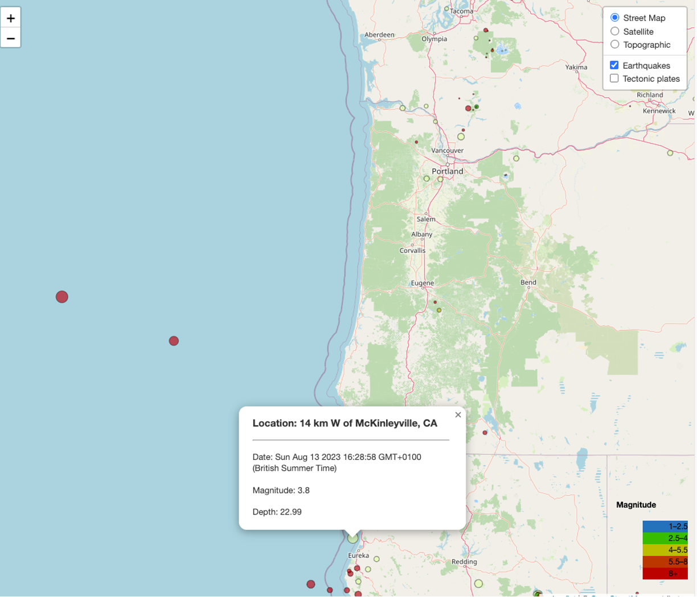

# Earthquakes

Presented by:Rachel Brimble, Jody-ann Frazer, Rafed Mahbub and Ugochi Prince Ajuobi on 15th August 2023

Welcome to "Earthquakes”, where we embark on a journey through historic data to analyse the trends of earthquakes over the last 20 years. In this presentation, we delve into data to answer a vital question: Are earthquakes on the rise?
We aim to achieve the following outcomes:

- A comprehensive understanding of global earthquake patterns and their relationship with tectonic plate boundaries.
- Visual representations of earthquake occurrences
- Insightful graphs depicting trends in earthquake frequency
- Research into the causes of observed trends and their implications
  We started off with creating a dashboard with navigation menu around the page for the research which would help viewing our visualisations and project summary easily using data analysis tools like html, css, javascript and other libraries. This was deployed to github pages which creates a link for anyone to visit the dashboard easily more like a website link in simple terms found below:

https://ugochiprince.github.io/Earthquakes/
We used API data to create visualisations showing the different global views of earthquake occurrences by location. We included a layer displaying tectonic plates as well as a clickable and popup map with zoom features.
We went further to then clean and scrape required data to create visualisations showing trends in earthquake occurrences over the last 20 years then used a Plotly chart to answer the question posed; “ARE EARTHQUAKES ON THE RISE?"
